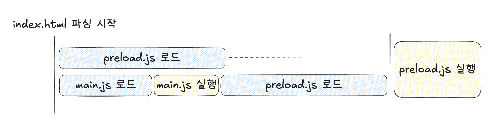

# vite-chunk-preload-poc

# 배경지식: Vite가 모듈을 불러오는 방식

- vite.config.mts에서 청크 스플리팅하는 옵션을 설정하면 index.html이 이런 모습으로 나옴.
  ```html
  <script type="module" crossorigin src="/assets/main.js"></script>
  <link rel="modulepreload" crossorigin href="/static/js/react.chunk.js" />
  ```
- 여기서 link 태그의 `modulepreload`는 ESM을 프리로드 하는 방식으로 청크를 미리 불러오고 사용하는쪽과 동일한 청크를 쓸 수 있도록 해주는 브라우저 스펙임. 크롬 66, iOS 17부터 지원함([caniuse](https://caniuse.com/?search=modulepreload)).
- 그럼 저렇게 프리로드한 청크를 실행하는 코드는 어디냐하면, main.js의 import를 통해서임. 즉, main.js를 까보면 `import React from "./static/js/react.chunk.js"` 같은 코드가 들어가 있음.
- 정리하면 Vite는 `modulepreload`를 통해 청크에 대해 네트워크 프리로드를 하며, 결과적으로 사용은 main.js에서 동일한 청크를 import 함으로써 사용함. 그리고 이런 방식 덕분에 프리로드하는 청크와 main.js간의 순서보장은 자연스럽게 이루어짐(다만 청크간의 순서보장은 해주지 않음).

# 요구사항: 단순 청크만 프리로드하는게 아니라, 청크 내부의 코드도 실행해서 오래걸리는 작업을 미리 처리하고 싶음

예를들면, App이 사용하는 어떤 오래걸리는 API에 대해 main.js 파일사이즈가 큰 경우 이걸 다 불러온 다음 API를 호출하는건 오래걸리니까 HTML 파싱타임에 API 호출까지 실행하고 싶은거임. 이렇게 실행해둔 Promise를 나중에 App에서 사용하고.

### 1. 전역객체(window)를 공유하는 방법

- 수도코드 https://github.com/Woomin-Jeon/vite-chunk-preload-poc/pull/1

  - 다음과 같이 preload.js라는 파일을 만들고

    ```jsx
    // preload.js
    const promise = API.getLongLatencyAPI(); // 호출해서 프로미스 생성

    // 전역 객체에 할당
    window.PRELOAD_JS = {
      getLongLatencyAPI: () => promise,
    };
    ```

  - index.html에 다음과 같이 script 태그를 사용해서 불러오는 로직을 추가
    ```jsx
    // index.html
    <script async src="./chunk/preload.js"></script>
    ```
  - 그리고 사용하는 쪽에서는 전역객체에 접근해서 사용
    ```jsx
    // App.js
    window.PRELOAD_JS.getLongLatencyAPI();
    ```

- 이 방식은 잘 동작하는데, 굉장히 맥락 의존적임. 전역객체를 사용하기 때문에 사용하는 쪽(App.js)입장에서는 이걸 누가 어디서 할당해주고 있는지 파악하기 어렵고, preload.js 파일만 봐서는 이걸 HTML 파싱타임에 프리로드된다는걸 알 수가 없음(번들러 매직임).
- 아울러 Vite는 알잘딱 저런 프리로드를 위한 script 태그를 넣어주지 않기 때문에, 번들러 설정 파일에서 index.html을 오버라이드하는 구현을 별도로 해줘야함. 이 역시 앞서 언급했던 코드간의 거리가 멀어지는걸 심화시키게됨.

### 2. ESM을 활용하는 방법

- 수도코드 https://github.com/Woomin-Jeon/vite-chunk-preload-poc/pull/2

  - 다음과 같이 preload.js라는 파일을 만들고

    ```jsx
    // preload.js
    const promise = API.getLongLatencyAPI(); // 호출해서 프로미스 생성

    export const getLongLatencyAPI = () => promise;
    ```

  - index.html에 다음과 같이 script 태그를 사용해서 불러오는 로직을 추가
    ```jsx
    // index.html
    <script async type="module" src="./chunk/preload.js"></script>
    ```
  - 그리고 사용하는 쪽에서는 import해서 사용
    ```jsx
    // App.js
    import { getLongLatencyAPI } from "./preload.js";
    getLongLatencyAPI();
    ```

- 이 방식은 사용하는쪽(App.js)에서 import문을 통해 불러오기 때문에 1번 방식인 전역객체를 활용하는 것에 비해서는 참조관계가 잘 드러남.
- 다만 1번 방식과 마찬가지로 preload.js 코드만 봐서는 이게 HTML 파싱타임에 미리 실행될 수 있도록 번들러가 script 태그를 추가해줄 거라는걸 파악하긴 어려움.
- 아울러 이렇게 되면 script 태그를 통해서도 preload.js 파일을 불러오고, main.js를 통해서도 import 문을 통해 preload.js 파일을 불러오게 되는데(위의 ”Vite가 모듈을 불러오는 방식” 내용), 이 타이밍이 겹치면 브라우저가 preload.js 파일을 queueing하는 문제가 생김.
  
  예를들어, index.html 파싱과정에서 preload.js 청크(이하 HTML 청크)를 로드하기 시작했는데, 이 로드가 끝나기 전에 main.js에서 preload.js 청크를 import하게되면(이하 main 청크) main 청크로드가 끝나기 전까지 HTML 청크는 대기상태가 되어 실행되지 않음. 결과적으로 main.js에서 preload.js를 불러온 다음에 실행되는거라 프리로드의 의미가 사라짐.
- 이 문제를 해결하기위해선 modulepreload를 사용하면 됨. 근데 위에 이야기했듯 이거 지원범위가 별로 넓지 않음.

### 3. 프리로드하는 곳을 index.html이 아니라 main.js로 써먹기

- main.js에서 프리로드하는 것과 실행하는 것들을 모두 dynamic import로 불러와서 main.js 사이즈를 최대한 줄이고 여기를 프리로드하는 곳으로 쓰는 방법임.
- 수도코드 https://github.com/Woomin-Jeon/vite-chunk-preload-poc/pull/3

  - 2번 ESM 방식과 같이 preload.js라는 파일을 만들고
    ```jsx
    // preload.js
    export const promise = API.getLongLatencyAPI(); // 호출해서 프로미스 생성
    ```
  - main.js에서 프리로드를 명시적으로 한 다음 App.js로 값들을 넘겨줌

    ```jsx
    // main.js
    const apiData =
    	import('./preload.js').then(module => module.promise)

    const preloader = {
      getLongLatencyAPI = () => apiData
    }

    import('./App.js').then(module => {
      module.renderApp(preloader) // preloader 주입
    })
    ```

- 이 방식은 1번과 2번처럼 index.html에서 프리로드를 하는 게 아니기 때문에 번들러 설정도 필요없고, 코드가 굉장히 예측가능해짐. 아울러 사용하는쪽에서도 명시적으로 preloader라는걸 받아서 쓰게되기 때문에 참조관계도 잘 드러남. 즉, 1번과 2번의 단점이었던 맥락 의존적인 문제들을 모두 해결함.
- 다만 기존 `index.html → preload.js 및 App.js` 이렇게 두 단계이던 네트워크 통신에 `index.html → main.js → preload.js 및 App.js` 으로 main.js가 하나 추가적으로 더 들어가기때문에 프리로드의 시작점은 조금 늦어지게 됨. 그렇기 때문에 main.js의 사이즈를 작게 유지하는게 중요해보임.
- 이 단점은 크리티컬하진 않다고 판단해서 이 방식이 제일 나아보임.
